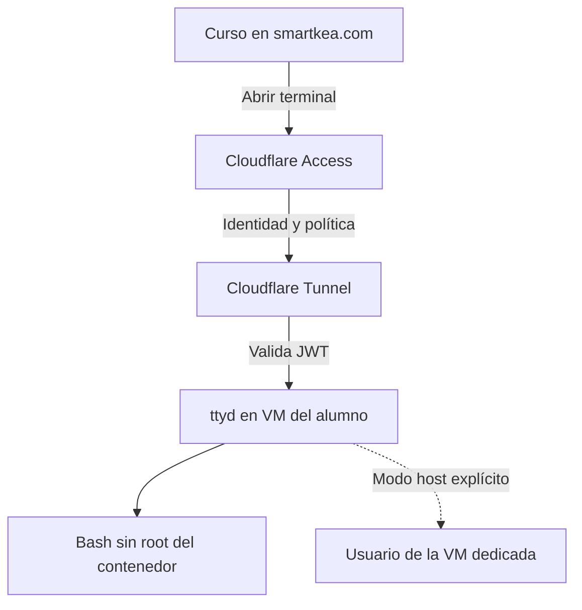

# Conectar el curso con una máquina Linux real

## 1. Arquitectura y decisiones

El sitio del curso se publica en `https://smartkea.com/fundamentos-ciberseguridad/term/`. La ejecución ocurre en una **VM dedicada al alumno**, accesible mediante un hostname separado, por ejemplo `https://term-a01.smartkea.com/`. El Worker entrega contenido y configuración pública; no ejecuta Bash ni recibe comandos para una shell.



La opción predeterminada abre el terminal en una pestaña nueva. El alumno lee, copia y pega cada comando conscientemente. La página no simula que tiene control de la máquina, no almacena credenciales y no envía órdenes por WebSocket.

Cloudflare Tunnel conecta el origen mediante conexiones salientes. Cloudflare recomienda crear primero la aplicación de Access y validar el JWT también antes de llegar al origen [S8, S9, S10]. El ejemplo implementa esa validación en `originRequest.access` **dentro de cada regla ingress**.

## 2. Qué necesitas decidir antes de conectarlo

Para cada alumno asigna una VM, un usuario Linux, un hostname de terminal y una política de Access. Mantén una tabla administrativa privada con esos vínculos. La aplicación pública del curso no debe contener un directorio de asignaciones personales.

| Dato | Ejemplo de estructura | Dónde se configura |
| --- | --- | --- |
| Curso | `smartkea.com/fundamentos-ciberseguridad/term/` | Worker estático del campus |
| Terminal | `term-a01.smartkea.com` | DNS, Tunnel y Access |
| Origen local | `http://127.0.0.1:7681` | Configuración de cloudflared |
| Equipo Access | Nombre del equipo, sin `.cloudflareaccess.com` | `teamName` |
| Audience | AUD real de esa aplicación | `audTag` |
| Credencial Tunnel | JSON generado por Cloudflare | Fuera del repositorio y con permisos mínimos |

Estos valores son ejemplos de forma, no una declaración de que ya existan esos hostnames. Para una primera instalación utiliza tu cuenta de alumno o instructor en una única VM de prueba y amplía después.

## 3. Arrancar la terminal del contenedor en la VM

Entra por SSH a la VM asignada y prepara Docker con la guía oficial [S2]. Clona el repositorio del curso y sitúate en la carpeta que contiene `labs/`:

```bash
docker compose -f labs/compose.yaml build web toolbox
docker compose -f labs/compose.yaml --profile terminal up -d --wait web terminal
curl --fail --silent --show-error --output /dev/null http://127.0.0.1:7681/
ss -lnt '( sport = :7681 )'
```

La escucha publicada debe ser `127.0.0.1:7681`. No necesita un puerto de entrada desde Internet. Mantén SSH restringido al mecanismo de administración previsto, y el tráfico de laboratorio fuera de la red corporativa.

## 4. Crear Access antes de publicar el Tunnel

En Cloudflare One, crea una aplicación **Self-hosted** para el hostname exacto `term-a01.smartkea.com`. Define una política Allow limitada al alumno asignado y, si procede, al instructor, con el proveedor de identidad y MFA acordados. Mantén la denegación para el resto de usuarios y evita una política Bypass. Una duración de sesión de una hora es una propuesta inicial de clase; la ajustas a la actividad [S8].

Cada hostname o aplicación debe tener su propio alcance. **Access autentica la visita, pero no crea usuarios Linux ni separa sus ficheros.** Dos identidades autorizadas al mismo ttyd pueden acceder al mismo usuario y volumen. `max-clients=1` limita conexiones simultáneas; no convierte un contenedor en un sistema multiusuario.

Obtén el AUD de la aplicación y el nombre de equipo. La credencial que identifica el túnel pertenece al administrador, no al alumno ni al HTML del curso.

## 5. Configurar un Tunnel con origen de loopback

Instala `cloudflared` desde la distribución oficial y sigue el procedimiento de túnel administrado localmente [S11]. Desde una sesión administrativa controlada:

```bash
cloudflared tunnel login
cloudflared tunnel create term-a01
```

El segundo comando muestra el UUID y crea un fichero de credenciales. Conserva ese fichero fuera del repositorio. Copia y edita `labs/config/cloudflared.example.yml` en una ubicación privada como `/etc/cloudflared/config.yml`. Sustituye el UUID, la ruta a la credencial, el hostname, `teamName` y `audTag` con los valores reales; no pegues el JSON de credenciales dentro del YAML ni en el chat.

La regla relevante mantiene estos controles:

```yaml
ingress:
  - hostname: term-a01.smartkea.com
    service: http://127.0.0.1:7681
    originRequest:
      httpHostHeader: term-a01.smartkea.com
      http2Origin: false
      access:
        required: true
        teamName: NOMBRE_REAL_DEL_EQUIPO
        audTag:
          - AUD_REAL_DE_LA_APLICACION
  - service: http_status:404
```

`httpHostHeader` coincide con el hostname HTTPS desde el que se abre ttyd. Así la comprobación de origen del WebSocket conserva un significado claro detrás del proxy. No desactives `--check-origin` para resolver un error de conexión: revisa primero Host, Origin, ruta y el acceso [S5, S10].

El issue upstream #1566, abierto el 11 de agosto de 2026, describe rechazos de `--check-origin` cuando ttyd recibe WebSockets directamente mediante HTTP/2 con TLS, por la diferencia entre `Host` y `:authority` [S20]. Nuestra configuración termina TLS en Cloudflare y mantiene HTTP/1.1 hasta ttyd con `http2Origin: false`; nginx, si se usa, también fija `proxy_http_version 1.1`. Por el mecanismo descrito en el reporte, esta arquitectura evita esa condición concreta; sigue siendo necesario comprobar el handshake en la VM. Conserva el hostname canónico sin `:443`, mantén `--check-origin` y no actives HTTP/2 hacia ese origen como arreglo de un fallo.

Valida la configuración antes de la ruta DNS y arranca el Tunnel con el UUID real:

```bash
cloudflared tunnel --config /etc/cloudflared/config.yml ingress validate
cloudflared tunnel route dns UUID_REAL_DEL_TUNNEL term-a01.smartkea.com
cloudflared tunnel --config /etc/cloudflared/config.yml run UUID_REAL_DEL_TUNNEL
```

Para ejecución persistente configura el servicio según la documentación del proveedor [S11]. Ajusta el usuario del servicio y la lectura del fichero de credenciales a la instalación elegida; no amplíes los permisos del fichero para resolver un error. Si utilizas un túnel gestionado desde el panel, aplica los mismos parámetros y activa **Protect with Access** en la ruta; la plantilla local es una alternativa de configuración, no un segundo túnel adicional.

## 6. Verificación con dos identidades

Realiza estas comprobaciones antes de habilitar escritura o entregar la URL:

1. En una ventana privada sin sesión, el hostname muestra Access o rechaza la petición. No debe abrir ttyd directamente.
2. La identidad del alumno asignado accede; una identidad de prueba fuera de la política no accede.
3. El origen directo no es accesible desde otra máquina. `ss -lnt` en la VM confirma la escucha de loopback y el firewall no publica 7681.
4. El panel ttyd muestra datos reales de esa VM/contenedor; el modo inicial no admite escritura.
5. En una segunda VM de alumno, el hostname correspondiente muestra otro entorno y otro volumen. Un marcador creado en una VM no aparece en la otra.
6. Comprueba la reconexión del WebSocket, el cierre de la sesión y la caducidad operativa. La duración de una cookie de acceso y la vida de un WebSocket ya establecido no deben tratarse como el mismo control. Termina el proceso o la VM al cerrar la ventana de laboratorio cuando necesites cortar conexiones activas.

Después de esas comprobaciones, para escritura en el contenedor:

```bash
docker compose -f labs/compose.yaml --profile terminal stop terminal
docker compose -f labs/compose.yaml --profile terminal-write up -d --wait web terminal-write
```

Comprueba de nuevo con `id`, `test ! -S /var/run/docker.sock` y `awk '/NoNewPrivs/{print}' /proc/self/status`. El alumno debe ver UID 10001 y `NoNewPrivs: 1`.

## 7. Conectar la interfaz del curso

El build del curso recibe tres variables públicas. Configúralas solo en el entorno de construcción autorizado:

```text
TERM_LAB_URL=https://term-a01.smartkea.com/
TERM_LAB_ALLOWED_ORIGINS=https://term-a01.smartkea.com
TERM_LAB_EMBED=0
```

`TERM_LAB_ALLOWED_ORIGINS` contiene los orígenes HTTPS exactos permitidos. Si necesitas varios, usa el formato admitido por el build del campus. La URL no debe incluir credenciales, query string ni fragmento. El hostname de terminal será distinto del campus. Deja `TERM_LAB_URL` sin definir para mantener la conexión desactivada.

Estos valores no son secretos y no sustituyen Access. Una URL fija en una página pública debe servir únicamente al grupo autorizado de ese laboratorio; para grupos con VMs individuales entrega enlaces específicos por el canal docente o crea una asignación autenticada antes de ampliar el modelo. No publiques una lista de correos y máquinas dentro del HTML.

Si habilitas `TERM_LAB_EMBED=1`, el curso debe permitir exclusivamente ese origen en `frame-src`, y el origen debe permitir `https://smartkea.com` en `frame-ancestors`. `labs/config/nginx-terminal.example.conf` muestra un proxy local opcional en 7683 que añade ese permiso; dirige el Tunnel a ese puerto cuando uses el proxy. Mantén la pestaña nueva si Access o el navegador impiden el acceso dentro del iframe. No elimines controles del proveedor para forzar la incrustación.

## 8. Practicar el sistema operativo de la VM con ttyd nativo

Para `sudo`, `systemctl`, paquetes del anfitrión y Docker, utiliza SSH a la VM o ttyd ejecutado **como el usuario de esa VM**. No montes `/var/run/docker.sock`, `/`, ni el home del anfitrión dentro del contenedor de terminal para alcanzar ese objetivo. El modo nativo se reserva a una máquina dedicada, con recursos y vida útil de laboratorio.

En la VM, comprueba si la distribución ofrece una versión adecuada:

```bash
apt-cache policy ttyd
ttyd --version
ttyd --help
```

Si ya existe un candidato soportado en tus repositorios, instálalo por el gestor de paquetes. El launcher comprueba `--writable` y `--check-origin`. Si no está disponible, la compilación reproducida a continuación utiliza el mismo commit upstream verificado que el contenedor; compila en la propia VM para respetar sus bibliotecas [S5]:

```bash
sudo apt-get update
sudo apt-get install -y --no-install-recommends ca-certificates git cmake build-essential pkg-config libjson-c-dev libwebsockets-dev libwebsockets-evlib-uv libuv1-dev tmux
mkdir -p "$HOME/src"
git clone https://github.com/tsl0922/ttyd.git "$HOME/src/ttyd-course"
git -C "$HOME/src/ttyd-course" checkout --detach 40e79c706be14029b391f369bee6613c31667abb
cmake -S "$HOME/src/ttyd-course" -B "$HOME/src/ttyd-course/build" -DCMAKE_BUILD_TYPE=MinSizeRel -DCMAKE_INSTALL_PREFIX=/usr/local
cmake --build "$HOME/src/ttyd-course/build" --parallel 2
sudo cmake --install "$HOME/src/ttyd-course/build"
ttyd --version
```

Desde la carpeta del módulo, **sin root**, instala los scripts y la unidad de usuario:

```bash
install -d -m 0700 "$HOME/.local/lib/smartkea-term" "$HOME/.config/systemd/user"
install -m 0500 labs/scripts/ttyd-host-start.sh labs/scripts/host-observe.sh labs/scripts/diagnose.sh "$HOME/.local/lib/smartkea-term/"
install -m 0600 labs/config/ttyd-user.service "$HOME/.config/systemd/user/ttyd-user.service"
systemctl --user daemon-reload
systemctl --user start ttyd-user.service
systemctl --user status ttyd-user.service
```

Para utilizar el puerto 7681 nativo, para antes los perfiles ttyd de Compose. La unidad inicia el modo lectura, limita procesos/memoria de la unidad y termina a las tres horas. Si necesitas continuidad fuera del inicio de sesión SSH, el administrador puede habilitar la persistencia de servicios de usuario para ese alumno conforme al ciclo de vida de la VM.

La escritura requiere un cambio deliberado de la unidad de usuario. Crea un override con `systemctl --user edit ttyd-user.service`:

```ini
[Service]
ExecStart=
ExecStart=%h/.local/lib/smartkea-term/ttyd-host-start.sh --writable
```

Luego ejecuta `systemctl --user daemon-reload` y `systemctl --user restart ttyd-user.service`. El acceso externo conserva el mismo esquema Access/Tunnel sobre loopback. El proceso ttyd no es root, aunque el alumno puede elevar permisos con su cuenta dentro de la VM según el ejercicio. Esa capacidad permite controlar toda esa VM; no la habilites en un anfitrión compartido con otras personas o servicios.

El modo nativo writable conecta una sesión tmux llamada `smartkea-lab`, exclusiva de esa cuenta y VM. El instructor puede observarla mediante la guía [INSTRUCTOR.md](INSTRUCTOR.md). Las referencias se encuentran en [SOURCES.md](SOURCES.md).
